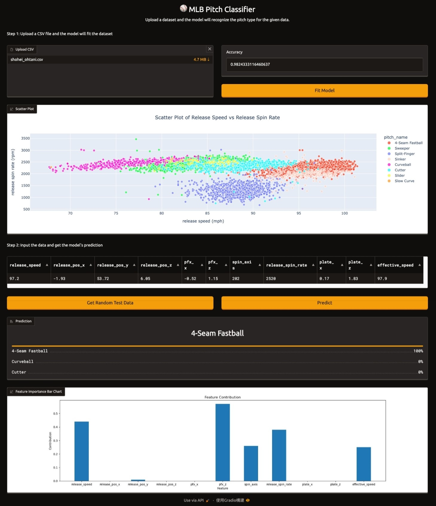

#  ⚾️ MLB Pitch Classifier 
**Final Project For Course: `Network and Database Programming`.**

## 🔖 Abstract
- This project aims to differentiate the pitch types based on the given pitcher's data.

## 🚀 Getting Started
### Prerequisites
  - Python >= 3.10
  - PyTorch >= 2.5

### Environment Setup
1. Clone this repository:
    ```bash
    git clone https://github.com/wangwenho/mlb-pitch-classifier.git
    ```
2. Create a conda environment:
    ```bash
    conda create -n mlb-pc python==3.10.16
    conda activate mlb-pc
    ```
3. Install required packages:
    ```bash
    conda install pytorch==2.5.0 torchvision==0.20.0 torchaudio==2.5.0 scikit-learn -c pytorch
    conda install captum==0.7 pandas matplotlib plotly ipykernel ipywidgets
    pip install gradio
    ```

## 📁 Dataset Preparation
### Option 1: Use Our Dataset
- We have provided 3 example datasets in the `dataset` folder in CSV format.

### Option 2: Use Custom Dataset
- Our dataset is downloaded from [Baseball Savant](https://baseballsavant.mlb.com/statcast_search). You can download the pitcher data you want by selecting the pitcher in the `Pitchers:` box, pressing the search button, and then downloading the data by clicking the link icon above the `Graph` column.
- For better results, it is recommended to use data after Statcast implementation. You can do this by going to `Season:` -> `Group Select:` -> `Statcast`.

## 📖 How to Use
- Simply run `evaluation.ipynb`, and click the link generated by the last block. This will open the browser and access the interface, and follow the instructions and see the results.
  1. Upload the prepared dataset and click `Fit Model`. The model will fit 80% of the given data, with the remaining 20% used for testing.
  2. Click `Get Random Test Data`, then click `Predict` to see which pitch type the model predicts.

- You might notice that the middle table only shows 11 column names from the dataset. This is because we only select a few important features to fit the model (random forest). You can check the documentation of these features from the [Statcast Search CSV Documentation](https://baseballsavant.mlb.com/csv-docs).
- The bottom bar chart shows the importance of each feature.

> 

## 🌟 Acknowledgement
- Thanks to [Baseball Savant](https://baseballsavant.mlb.com/) for providing such a platform with detailed statistics and data visualization graphs for educational purposes :)